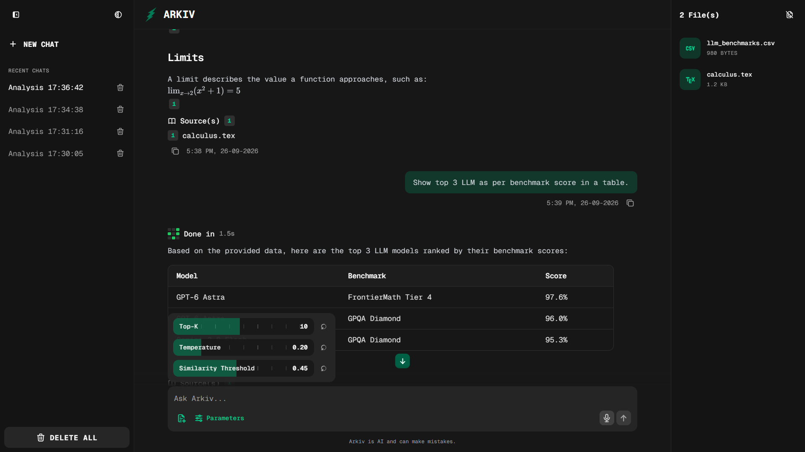

<h1 align="center">
  
   
  <b>Arkiv</b>
</h1>

  <a href="https://arkiv.hirishi.in"><b>Arkiv</b></a> is an intelligent, document-grounded conversational assistant. Built with a <a href="https://nextjs.org"><b>Next.js</b></a> frontend and a <a href="https://fastapi.tiangolo.com"><b>FastAPI</b></a> backend, it leverages <b>Retrieval-Augmented Generation (RAG)</b> to let you upload various document formats and query their contents using natural language.

  
  

---

## ✳️ _Supported Formats_

| FORMAT | EXTENSION | LOADER | SUPPORT |
| :---: | :---: | :---: | :---: |
| **PDF** | _.pdf_ | PyMuPDF4LLMLoader | ✅ Supported |
| **CSV** | _.csv_ | UnstructuredCSVLoader | ✅ Supported |
| **Text** | _.txt_ | TextLoader | ✅ Supported |
| **Markdown** | _.md_ | UnstructuredMarkdown | ✅ Supported |
| **JSON** | _.json_ | JSONLoader | ✅ Supported |
| **LaTeX** | _.tex_ | TextLoader | ✅ Supported |
| **Word** | _.docx_ | UnstructuredWordLoader | ✅ Supported |
| **Excel** | _.xlsx_ | UnstructuredExcelLoader | ✅ Supported |
| **PowerPoint** | _.pptx_ | UnstructuredPPTLoader | ✅ Supported |

---

## ✳️ _System Overview_

Arkiv uses a decoupled architecture with a **Next.js** frontend and a **FastAPI** backend, connected over REST. The RAG pipeline processes diverse document types, chunks the text, embeds it using Gemini Embeddings, and stores it in a **Qdrant Cloud** vector database, ensuring highly accurate, context-aware responses and reducing hallucinations typical of standard LLMs.

---

## ✳️ _Architecture_

| # | COMPONENT | DESCRIPTION | STACK |
| :---: | :---: | :---: | :---: |
| 1️⃣ | **Frontend** | Chat interface for querying documents | **_TypeScript_**, **_Next.js_**, **_Tailwind CSS_**, **_shadcn/ui_** |
| 2️⃣ | **Backend** | REST API handling file processing and LLM chat | **_Python_**, **_FastAPI_**, **_Uvicorn_** |
| 3️⃣ | **RAG Pipeline** | Ingestion, chunking, and embedding logic | **_Python_**, **_LangChain_**, **_Qdrant Cloud_** |
| 4️⃣ | **Chat Engine** | Context-aware session-isolated response engine | **_FastAPI_**, **_LangChain_**, **_Gemini 3.1 Flash_** |

---

## ✳️ _Instructions_

For detailed setup and usage instructions, refer to the respective README files:

▶️ [**_`Backend Instructions`_**](./backend/README.md) - Setting up & running the FastAPI backend

▶️ [**_`Frontend Instructions`_**](./frontend/README.md) - Setting up & running the Next.js frontend

---

  Made with ⚡ by <a href="https://hirishi.in">Saptarshi Roy</a>

